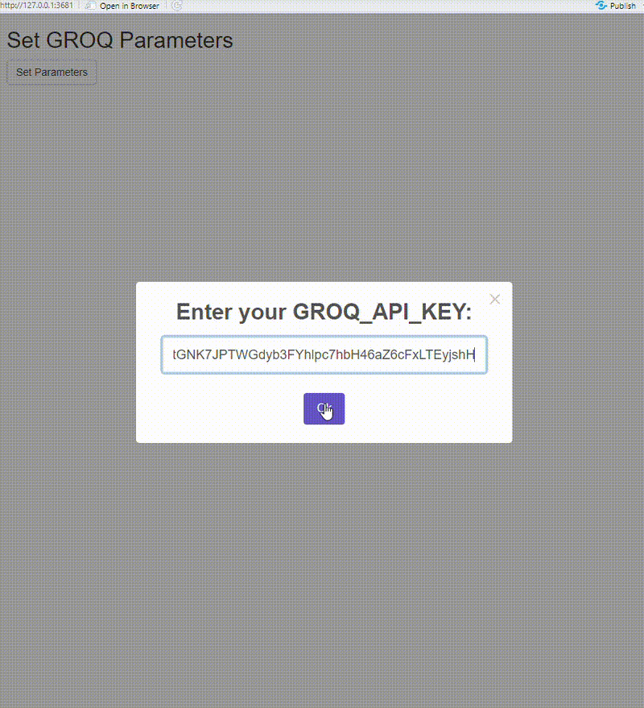
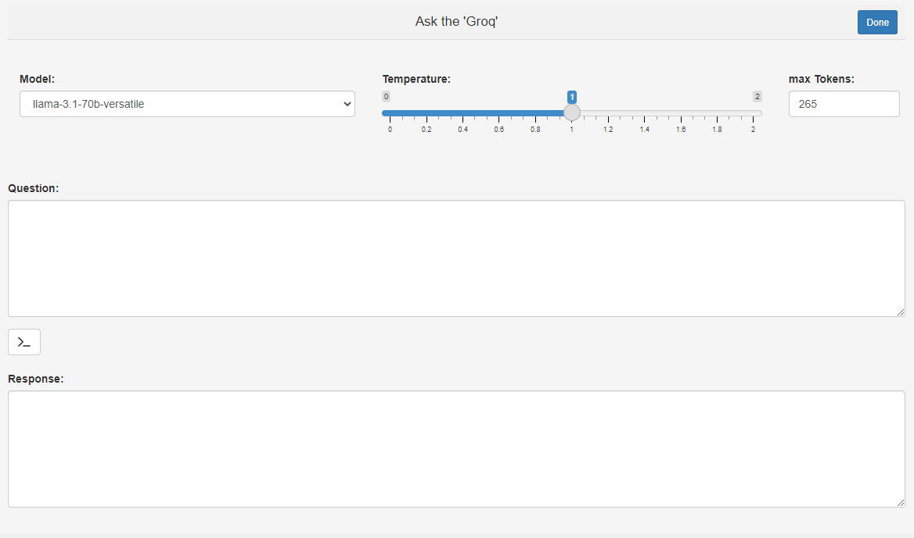

<!-- README.md is generated from README.Rmd. Please edit that file -->

# groqR <a href="https://github.com/GabrielKaiserQFin/groqR"></a>

<!-- badges: start -->

[](https://CRAN.R-project.org/package=groqR)
[](https://cran.rstudio.com/web/packages/groqR/index.html)
[](https://github.com/GabrielKaiserQFin/groqR/actions/workflows/R-CMD-check.yaml)
[](https://github.com/GabrielKaiserQFin/groqR/actions/workflows/R-CMD-check.yaml)
<!-- badges: end -->

The objective of `groqR` is to offer R users an intuitive interface for
leveraging the capabilities of the [‘Groq API’](https://groq.com/).
Utilizing the supplied functions, users can enhance their programming
productivity by incorporating Large Language Models. Furthermore,
`groqR` includes an RStudio addin, enabling seamless interactive
integration of ‘Groq’ prompts.

**Why Choose groqR?**  
- ⚡ **10x faster** than GPU-based solutions  
- 🔒 Enterprise-grade data privacy  
- 📚 Supports multiple LLMs (DeepSeek-R1, Llama-3, Mixtral)  
- 🆓 Free tier available

## Installation

You can install the development version of groqR from
[GitHub](https://github.com/GabrielKaiserQFin/groqR) with:

``` r
# install.packages("devtools")
devtools::install_github("GabrielKaiserQFin/groqR")
```

<!-- Or install the current released version of `{groqR}` from  -->
<!-- [CRAN](https://cran.r-project.org/package=groqR): -->
<!-- ```{r eval = FALSE} -->
<!-- install.packages("groqR") -->
<!-- ``` -->

## Requirements

You need to create a free account and a free ‘API’ key by accessing
[‘Groq API’ page](https://console.groq.com/keys), otherwise you can not
use `{groqR}`. To use your ‘API’ key in `{groqR}`, you need to configure
the function parameters in the .Renviron file.

## Initial Steps

When you run it for the first time, a Shiny app will launch to guide you
through the initial steps, setting up the necessary environment
variables for the GROQ system.



## Addins

In your RStudio go to **Addins** and select **Ask ‘Groq’**, which will
open an interactive prompt in your Viewer, where you can choose between
different models and adjust the temperature and the number of tokens to
be used. Simply ask anything of your interest and hit the confirm
button. The **Done** button lets you close the App. Similarly, you can
mark or copy any text or code and use the other Addins as described
below. Addin shortcuts will improve your efficiency.



## How It Works

**ask:**

This is a basic example which shows you how to ask any question.

``` r
ask("What do you think about Large language models?")
```

**rewriter:**

This is a basic example which shows you how to rewrite text.

``` r
rewriter("Dear Recipient, I hope this message finds you well.")
```

**translater:**

This is a basic example which shows you how to translate text.

``` r
translater("Dear Recipient, I hope this message finds you well.", toLanguage = "Spanish")
```

**codeComment:**

This is a basic example which shows you how to document code.

``` r
codeComment("z <- function(x) scale(x)^2")
```

**unitTests:**

This is a basic example which shows you how to build Unit Tests for your
function.

``` r
unitTests("z <- function(x) scale(x)^2")
```

**debug:**

This is a basic example which shows you how to find bugs in your code.

``` r
debug("z <- function(x) scale(x)2")
```

**roxy:**

This is a basic example which shows you how to document your code.
Formatting style is `Roxygen2` but can be set to anything.

``` r
roxy("z <- function(x) scale(x)^2")
```

**coder:**

This is a basic example which shows you how to finish your code by
‘Groq’.

``` r
coder("# A function to scale a vector and square the resulting z-score z2 <- function(")
```

**optimizer:**

This is a basic example which shows you how to optimize your code.

``` r
optimizer("z <- function(x) scale(x)^2")
```

**codeConverter:**

This is a basic example which shows you how to translate your code.

``` r
codeConverter("z <- function(x) scale(x)^2", from = "R", to = "Python")
```

**nameIt:**

This is a basic example which shows you how to create a function or
variable name.

``` r
nameIt("function(x) scale(x)^2")
```

## Groq Model Arguments

The model parameters can be adjusted by passing functional arguments.

- `text` or `code`: The text or code input required for processing by
  ‘Groq’. If omitted, the function will utilize the content currently
  held in the clipboard.

- `GROQ_API_KEY`: The ‘Groq API’ key. By default it is set to
  `Sys.getenv("GROQ_API_KEY")`.

- `model`: model choice. Choose any
  [model](https://console.groq.com/docs/models) and add it to your
  .Renviron file or as argument within the function in mind.

``` r
modelCall()[,1:5]
                              id object    created        owned_by active
1                llama3-70b-8192  model 1693721698            Meta   TRUE
2               whisper-large-v3  model 1693721698          OpenAI   TRUE
3           llama-3.2-1b-preview  model 1727224268            Meta   TRUE
4          llama-3.3-70b-specdec  model 1733505017            Meta   TRUE
5   llama-3.2-11b-vision-preview  model 1727226869            Meta   TRUE
6     distil-whisper-large-v3-en  model 1693721698    Hugging Face   TRUE
7               llama-guard-3-8b  model 1693721698            Meta   TRUE
8                   gemma2-9b-it  model 1693721698          Google   TRUE
9        llama-3.3-70b-versatile  model 1733447754            Meta   TRUE
10 deepseek-r1-distill-llama-70b  model 1737924940 DeepSeek / Meta   TRUE
11                llama3-8b-8192  model 1693721698            Meta   TRUE
12        whisper-large-v3-turbo  model 1728413088          OpenAI   TRUE
13  llama-3.2-90b-vision-preview  model 1727226914            Meta   TRUE
14            mixtral-8x7b-32768  model 1693721698      Mistral AI   TRUE
15          llama-3.2-3b-preview  model 1727224290            Meta   TRUE
16          llama-3.1-8b-instant  model 1693721698            Meta   TRUE
```

- `systemRole`: System role for model. Default is set to “You are a
  helpful assistant”.

- `maxTokens`: The maximum integer of completion tokens returned by the
  ‘API’. The total number of tokens requested in max_tokens plus the
  number of prompt tokens sent in messages must not exceed the context
  window token limit of model requested. If left unspecified, then the
  model will generate tokens until either it reaches its stop token or
  the end of its context window.

- `temperatur`: The amount of randomness in the response, valued between
  0 inclusive and 2 exclusive. Higher values are more random, and lower
  values are more deterministic. You should either set temperature or
  top_p, but not both.

- `top_p`: The nucleus sampling threshold, valued between 0 and 1
  inclusive. For each subsequent token, the model considers the results
  of the tokens with top_p probability mass. You should either alter
  temperature or top_p, but not both.

- `proxy`: Default value is NULL. To execute ‘Groq’ queries via a proxy
  server, specify the proxy address and port as an argument to the
  function instance. Use the following format:
  `"proxy_address:proxy_port"`. An example would be:
  `"81.94.255.13:8080"`

- `returnType`: Default is 3, which returns the output to the clipboard
  and returns TRUE, type 2 is unchanged and type 1 cats the output.
